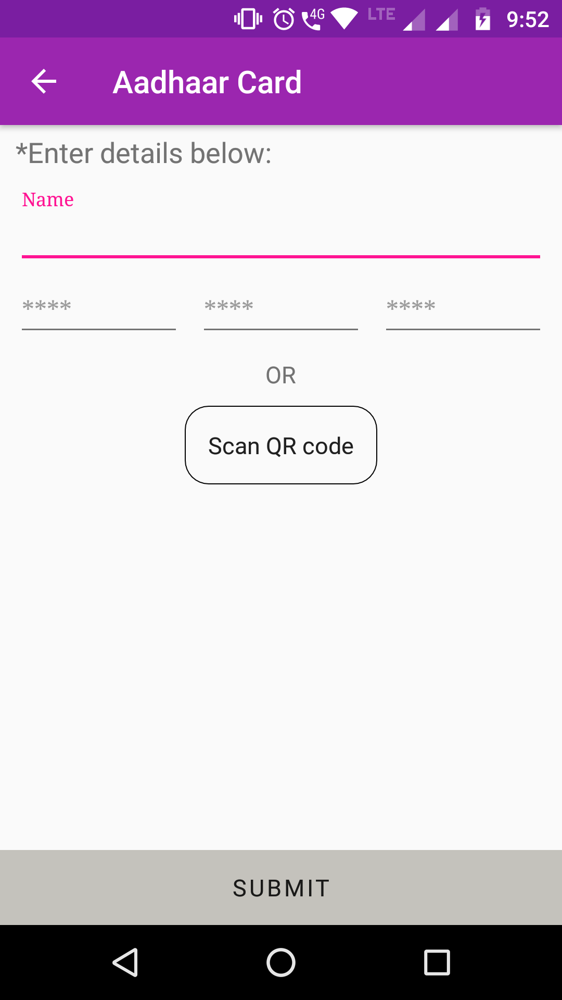

# Card Gallery
An android application that is designed in order to store important information of the user's document in a smart way. The user can also scan any documents that are required and the copy will be directly saved to the phone's gallery.

 ##### Key features:
 - Provides an interface to card Holders to carry their important details anytime and anywhere in smart phones.
 
 -	Scan Aadhaar Card data to retrieve accurate information from it instead of manually entering it.
 
 - Can add your family members profile in your device.
 
 - If you entered any wrong details you can delete the data and enter the details once again.If needed you can share the details with your fammily and friends using this application.
 
 
##### Usage Guidelines:

 - Application will ask for password as soon as it is opened as the first step. User should enter a password containing only numbers and of length 4 e.g. 1234
 
##### <b> In case of any issue or query, please write to jocelinthomas177@gmail.com</b>

##### <b> Attaching some screenshots: </b> 

  

  

    

  

  
